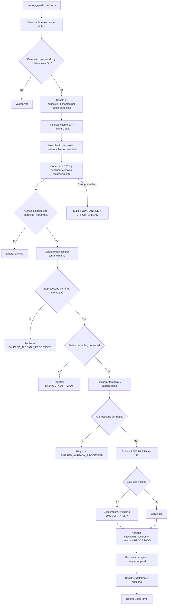
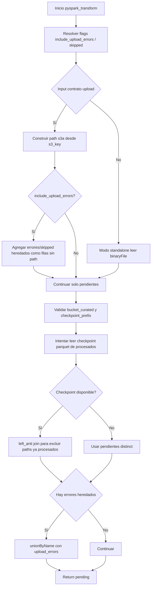
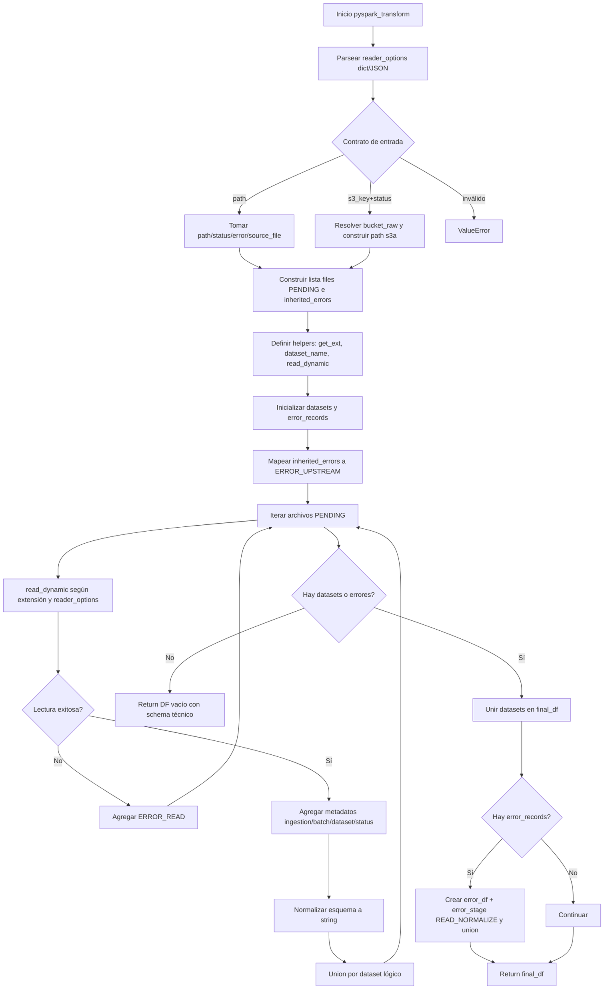
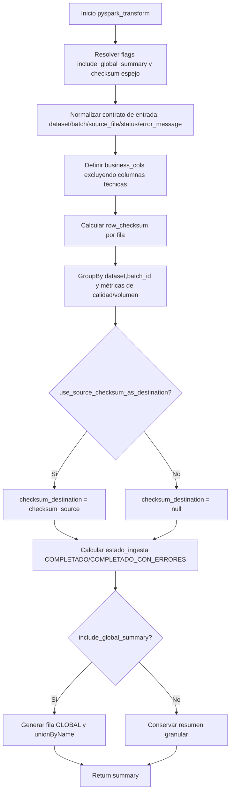

# Diagramas de flujo de los scripts PySpark

Este documento resume el flujo funcional de cada archivo `.py` del repositorio mediante diagramas Mermaid.

## Arquitectura inferida del proyecto

Se observa un **pipeline de ingestión modular por etapas** (upload → discovery → read/normalize → summary), con contratos de DataFrame entre nodos y patrones de resiliencia (checkpoint, idempotencia, quarantine, manejo de errores heredados).

## 1) `pys_upload.py`

## 2) `pys_dicovery_node.py`

## 3) `pys_read_normalize.py`

## 4) `pys_ingestion_summary.py`

