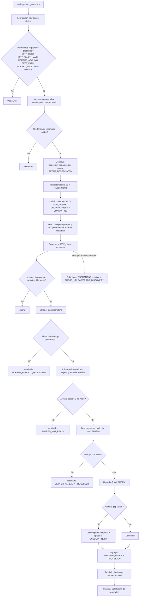
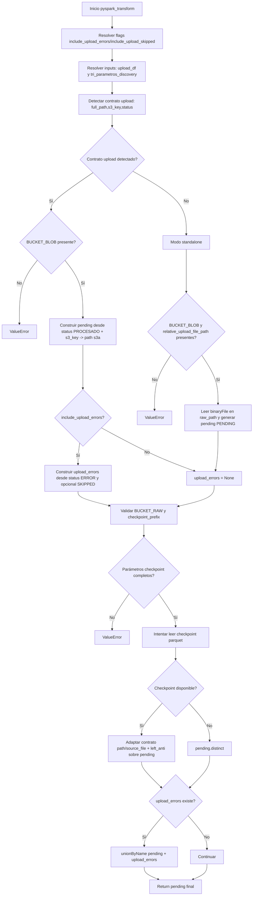
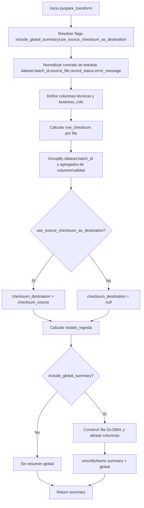
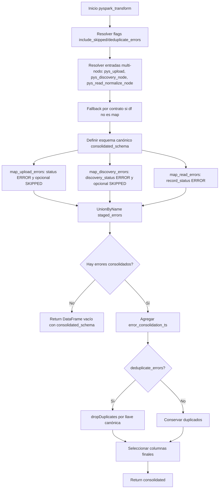

# Diagramas de flujo de los scripts PySpark

Este documento actualiza el flujo funcional de **cada archivo `.py`** del repositorio con diagramas Mermaid y una lectura arquitectónica consistente con la implementación real.

## Arquitectura inferida del proyecto

El repositorio implementa un **pipeline de ingestión de datos por etapas (ETL/ELT modular)** con contratos de DataFrame entre nodos:

1. **Extracción y aterrizaje (`pys_upload.py`)**: descarga desde SFTP, aplica idempotencia y publica en zona raw/quarantine.
2. **Descubrimiento (`pys_dicovery_node.py`)**: construye pendientes desde salida de upload o modo standalone, con exclusión por checkpoint.
3. **Lectura y normalización (`pys_read_normalize.py`)**: lectura dinámica multi-formato, expansión de comprimidos y homologación de esquema.
4. **Resumen de calidad/volumen (`pys_ingestion_summary.py`)**: métricas por dataset/batch y checksums.
5. **Consolidación de errores (`pys_error_consolidation.py`)**: unificación canónica de errores de múltiples etapas.
6. **Publicación curated (`pys_write_curated.py`)**: escritura current + history (Delta) y checkpoint de escritura.

Patrones dominantes detectados: **parameter guard**, **multi-input resolver**, **checkpointing incremental**, **idempotencia**, **contratos flexibles entre nodos** y **tratamiento explícito de errores como datos**.

---

## 1) `pys_upload.py`

```mermaid
flowchart TD
    A[Inicio pyspark_transform] --> B[Leer param_row desde df.first]
    B --> C{Parámetros requeridos presentes?<br/>SFTP_HOST, SFTP_VAULT_NAME, NOMBRE_ARCHIVO,<br/>SFTP_PATH, BUCKET_BLOB, paths relativos}
    C -- No --> Z1[ValueError]
    C -- Sí --> D[Obtener credenciales desde spark.conf por vault]
    D --> E{Credenciales user/pass válidas?}
    E -- No --> Z2[ValueError]
    E -- Sí --> F[Construir expected_filenames por rango FECHA_DESDE/HASTA]
    F --> G[Inicializar cliente S3 + TransferConfig]
    G --> H[Definir CHECKPOINT / RAW_PREFIX / UNCOMP_PREFIX / QUARANTINE]
    H --> I[Leer checkpoint parquet y recuperar hashes + firmas metadata]
    I --> J[Conectar a SFTP y listar recursivo]
    J --> K{remote_filename en expected_filenames?}
    K -- No --> KN[Ignorar]
    K -- Sí --> L[Obtener stat: size/mtime]
    L --> M{Firma metadata ya procesada?}
    M -- Sí --> MS[resultado SKIPPED_ALREADY_PROCESSED]
    M -- No --> N[Aplicar policy readiness: espera y revalidación size]
    N --> O{Archivo estable y no vacío?}
    O -- No --> OS[resultado SKIPPED_NOT_READY]
    O -- Sí --> P[Descargar tmp + calcular hash SHA256]
    P --> Q{Hash ya procesado?}
    Q -- Sí --> QS[resultado SKIPPED_ALREADY_PROCESSED]
    Q -- No --> R[Upload a RAW_PREFIX]
    R --> S{Archivo gzip válido?}
    S -- Sí --> T[Descomprimir temporal y upload a UNCOMP_PREFIX]
    S -- No --> U[Continuar]
    T --> V[Agregar checkpoint_records + PROCESADO]
    U --> V
    J -->|Error por archivo/directorio| W[Subir tmp a QUARANTINE si existe + ERROR_UPLOAD/ERROR_DISCOVERY]
    V --> X[Persistir checkpoint parquet append]
    X --> Y[Retornar DataFrame de resultados]
```

## 2) `pys_dicovery_node.py`

```mermaid
flowchart TD
    A[Inicio pyspark_transform] --> B[Resolver flags include_upload_errors/include_upload_skipped]
    B --> C[Resolver inputs: upload_df y tri_parametros_discovery]
    C --> D[Detectar contrato upload: full_path,s3_key,status]
    D --> E{Contrato upload detectado?}
    E -- Sí --> F{BUCKET_BLOB presente?}
    F -- No --> Z1[ValueError]
    F -- Sí --> G[Construir pending desde status PROCESADO + s3_key -> path s3a]
    G --> H{include_upload_errors?}
    H -- Sí --> I[Construir upload_errors desde status ERROR y opcional SKIPPED]
    H -- No --> J[upload_errors = None]
    E -- No --> K[Modo standalone]
    K --> L{BUCKET_BLOB y relative_upload_file_path presentes?}
    L -- No --> Z2[ValueError]
    L -- Sí --> M[Leer binaryFile en raw_path y generar pending PENDING]
    M --> J
    I --> N[Validar BUCKET_RAW y checkpoint_prefix]
    J --> N
    N --> O{Parámetros checkpoint completos?}
    O -- No --> Z3[ValueError]
    O -- Sí --> P[Intentar leer checkpoint parquet]
    P --> Q{Checkpoint disponible?}
    Q -- Sí --> R[Adaptar contrato path/source_file + left_anti sobre pending]
    Q -- No --> S[pending.distinct]
    R --> T{upload_errors existe?}
    S --> T
    T -- Sí --> U[unionByName pending + upload_errors]
    T -- No --> V[Continuar]
    U --> W[Return pending final]
    V --> W
```

## 3) `pys_read_normalize.py`

```mermaid
flowchart TD
    A[Inicio pyspark_transform] --> B[Resolver input_df (pys_discovery_node) y tri_parametros_read]
    B --> C[Parsear READER_OPTIONS dict/JSON]
    C --> D{Input contiene columna path?}
    D -- No --> Z1[ValueError]
    D -- Sí --> E[Construir files PENDING + inherited_errors]
    E --> F[Definir helpers: get_ext, dataset_name, read_dynamic]
    F --> G[Definir expansión de comprimidos: gz/bz2 passthrough, zip expansion]
    G --> H[Inicializar datasets y error_records]
    H --> I[Mapear inherited_errors como ERROR_UPSTREAM]
    I --> J[Iterar cada archivo PENDING]
    J --> K[expand_input_paths]
    K --> L{Expansión OK?}
    L -- No --> M[Registrar ERROR_READ]
    L -- Sí --> N[Iterar targets (path o miembros ZIP)]
    N --> O[read_dynamic según ext y reader_options]
    O --> P{Lectura OK?}
    P -- No --> Q[Registrar ERROR_READ]
    P -- Sí --> R[Agregar metadata: ingestion_ts, source_file, path, batch_id, dataset, record_status]
    R --> S[Cast de todas las columnas a string]
    S --> T[Union por dataset lógico]
    M --> J
    Q --> N
    T --> J
    J --> U{Hay datasets o errores?}
    U -- No --> V[Return DF vacío técnico]
    U -- Sí --> W[Unir datasets en final_df]
    W --> X{Hay error_records?}
    X -- Sí --> Y[Crear error_df + error_stage READ_NORMALIZE y unionByName]
    X -- No --> Z[Continuar]
    Y --> AA[Return final_df]
    Z --> AA
```

## 4) `pys_ingestion_summary.py`

```mermaid
flowchart TD
    A[Inicio pyspark_transform] --> B[Resolver flags include_global_summary/use_source_checksum_as_destination]
    B --> C[Normalizar contrato de entrada: dataset,batch_id,source_file,record_status,error_message]
    C --> D[Definir columnas técnicas y business_cols]
    D --> E[Calcular row_checksum por fila]
    E --> F[GroupBy dataset,batch_id y agregados de volumen/calidad]
    F --> G{use_source_checksum_as_destination?}
    G -- Sí --> H[checksum_destination = checksum_source]
    G -- No --> I[checksum_destination = null]
    H --> J[Calcular estado_ingesta]
    I --> J
    J --> K{include_global_summary?}
    K -- Sí --> L[Construir fila GLOBAL y alinear columnas]
    K -- No --> M[Sin resumen global]
    L --> N[unionByName summary + global]
    M --> O[Return summary]
    N --> O
```

## 5) `pys_error_consolidation.py`

```mermaid
flowchart TD
    A[Inicio pyspark_transform] --> B[Resolver flags include_skipped/deduplicate_errors]
    B --> C[Resolver entradas multi-nodo: pys_upload, pys_discovery_node, pys_read_normalize_node]
    C --> D[Fallback por contrato si df no es map]
    D --> E[Definir esquema canónico consolidated_schema]
    E --> F[map_upload_errors: status ERROR y opcional SKIPPED]
    E --> G[map_discovery_errors: discovery_status ERROR y opcional SKIPPED]
    E --> H[map_read_errors: record_status ERROR]
    F --> I[UnionByName staged_errors]
    G --> I
    H --> I
    I --> J{Hay errores consolidados?}
    J -- No --> K[Return DataFrame vacío con consolidated_schema]
    J -- Sí --> L[Agregar error_consolidation_ts]
    L --> M{deduplicate_errors?}
    M -- Sí --> N[dropDuplicates por llave canónica]
    M -- No --> O[Conservar duplicados]
    N --> P[Seleccionar columnas finales]
    O --> P
    P --> Q[Return consolidated]
```

## 6) `pys_write_curated.py`

```mermaid
flowchart TD
    A[Inicio pyspark_transform] --> B[Resolver input_df y param_df (tri_parametros_write)]
    B --> C{input_df válido?}
    C -- No --> Z1[ValueError]
    C -- Sí --> D[Error Interceptor: buscar record_status ERROR]
    D --> E{Hay errores?}
    E -- Sí --> F[Retornar input_df sin escribir]
    E -- No --> G{input_df vacío?}
    G -- Sí --> H[Return control DF SKIPPED_NO_DATA]
    G -- No --> I[Leer RUTA_SALIDA/NOMBRE_TABLA/BUCKET_RAW]
    I --> J{RUTA_SALIDA y NOMBRE_TABLA presentes?}
    J -- No --> Z2[ValueError]
    J -- Sí --> K[Construir current_path/history_path]
    K --> L[Agregar write_ts y table_name]
    L --> M{ENABLE_REPROCESS?}
    M -- Sí --> N[Escribir current parquet overwrite]
    M -- No --> O[Escribir current parquet errorifexists]
    N --> P[Gestionar history Delta]
    O --> P
    P --> Q{history existe y ENABLE_REPROCESS?}
    Q -- Sí --> R[Intentar limpiar history (DeltaTable.delete)]
    Q -- No --> S[Continuar]
    R --> T[Append history delta]
    S --> T
    T --> U{BUCKET_RAW y checkpoint_prefix presentes?}
    U -- Sí --> V[Generar checkpoint_base de paths escritos + append parquet]
    U -- No --> W[Omitir checkpoint]
    V --> X[Return control DF WRITTEN]
    W --> X
```
