# Diagrama de flujo - `pys_descubrimiento_archivos.py`

Diagrama en Mermaid con subprocesos separados horizontalmente (uno al lado del otro) y conectados según el flujo real del script.

```mermaid
flowchart LR

subgraph SP0
  direction TB
  SP0T[SP0 Inicializacion y contrato de estado]
  A0[Inicio pyspark_transform]
  A1[Crear process_log append_log build_status_df]
  A2[Definir is_missing]
  A3[Log Inicio pys_descubrimiento_archivos]
  SP0T --> A0 --> A1 --> A2 --> A3
end

subgraph SP1
  direction TB
  SP1T[SP1 Resolucion de entradas y parametros]
  B1[Resolver upload_df y param_discovery_row]
  B2[Definir get_param_discovery_value]
  B3[Extraer bucket_blob y bucket_raw]
  B4[Detectar contrato de entrada]
  B5{Tiene contrato estandarizado}
  B6{Tiene contrato path}
  SP1T --> B1 --> B2 --> B3 --> B4 --> B5
end

subgraph SP2
  direction TB
  SP2T[SP2 Construccion de pendientes]
  C1[Leer estado upload_status_row]
  C2{Estado FALLIDO}
  C3[Retornar contrato estandarizado de error]
  C4[Retornar FALLIDO sin paths]
  C5[Construir pending desde path]
  C6[Log contrato de exito detectado]
  C7[Leer relative_upload_file_path]
  C8{bucket_blob presente}
  C9{relative_upload_file_path presente}
  C10[Construir raw_path en original]
  C11[Leer binaryFile y construir pending]
  C12[Log modo standalone]
  SP2T --> C1 --> C2
end

subgraph SP3
  direction TB
  SP3T[SP3 Filtro incremental por checkpoint]
  D1[Leer checkpoint_prefix]
  D2{bucket_raw presente}
  D3{checkpoint_prefix presente}
  D4[Construir checkpoint_path]
  D5[Intentar leer parquet checkpoint]
  D6[Adaptar contrato path source_file]
  D7[Normalizar processed no vacio]
  D8[Left anti join pending vs processed]
  D9[Log checkpoint aplicado]
  D10[Fallback pending distinct]
  D11[Log sin exclusion incremental]
  SP3T --> D1 --> D2
end

subgraph SP4
  direction TB
  SP4T[SP4 Cierre y salida]
  E1[Contar total_pending valido]
  E2[Log archivos pendientes detectados]
  E3[Log descubrimiento finalizado]
  E4[Retornar pending]
  SP4T --> E1 --> E2 --> E3 --> E4
end

A3 --> B1

B5 -- Si --> C1
C2 -- Si --> C3
C2 -- No --> C4

B5 -- No --> B6
B6 -- Si --> C5 --> C6 --> D1
B6 -- No --> C7 --> C8
C8 -- No --> X1[FALLIDO falta BUCKET_BLOB]
C8 -- Si --> C9
C9 -- No --> X2[FALLIDO falta relative_upload_file_path]
C9 -- Si --> C10 --> C11 --> C12 --> D1

D2 -- No --> X3[FALLIDO falta BUCKET_RAW]
D2 -- Si --> D3
D3 -- No --> X4[FALLIDO falta checkpoint_prefix]
D3 -- Si --> D4 --> D5
D5 -- exito --> D6 --> D7 --> D8 --> D9 --> E1
D5 -- excepcion --> D10 --> D11 --> E1
```

## Lectura rapida por subproceso

- **SP0**: Inicializa utilitarios de log y contrato de salida estandarizado.
- **SP1**: Resuelve entradas del orquestador y detecta el tipo de contrato recibido.
- **SP2**: Construye el dataset `pending` desde contrato estandarizado, contrato por `path` o modo standalone.
- **SP3**: Aplica deduplicacion incremental con checkpoint (incluye compatibilidad con contratos antiguos/nuevos).
- **SP4**: Calcula metricas finales, registra logs y retorna el resultado.
