# Diagrama de flujo — `pys_subida_archivos.py`

Este diagrama separa el proceso en **subprocesos paralelos (swimlanes)** conectados entre si: validacion, conexion SFTP, carga S3, checkpoint y salida.

```mermaid
flowchart LR

subgraph SP0[SP0 Inicializacion y utilidades]
direction TB
A0[Inicio pyspark_transform]
A1[Crear process_log y helpers]
A2[Definir normalizadores]
A3[Definir build_expected_filenames]
end

subgraph SP1[SP1 Validacion de entrada y parametros]
direction TB
B1[Validar columnas requeridas]
B2{Faltan columnas}
B3[Leer primera fila param_row]
B4{param_row es None}
B5[Extraer parametros de fila]
B6{Falta parametro requerido}
B7[Leer credenciales desde spark conf]
B8{Credenciales validas}
B9[Leer rutas desde param_dict]
B10{Bucket y rutas validos}
B11[Construir expected filenames]
B12{Fechas validas}
end

subgraph SP2[SP2 Preparacion de conectores y politicas]
direction TB
C1[Crear cliente S3]
C2{S3 inicializado}
C3[Configurar TransferConfig]
C4[Definir CHECKPOINT QUARANTINE RAW UNCOMP]
C5[Definir file_hash y list_files_recursive]
end

subgraph SP3[SP3 Carga de estado previo checkpoint]
direction TB
D1[Leer parquet CHECKPOINT]
D2[Normalizar columnas faltantes]
D3[Reconstruir processed_hashes y signatures]
D4[Si falla lectura usar sets vacios]
end

subgraph SP4[SP4 Ingesta SFTP a S3 por archivo]
direction TB
E1[Abrir conexion SFTP]
E2[Listar archivos recursivamente]
E3[Iterar cada archivo remoto]
E4[Calcular rel_path filename tmp]
E5{Filename esperado}
E6[Leer metadata size y mtime]
E7{Signature ya procesada}
E8[Readiness check]
E9{Archivo listo y no vacio}
E10[Descargar a tmp]
E11[Calcular hash]
E12{Hash ya procesado}
E13[Subir a RAW_PREFIX]
E14[Detectar gzip]
E15{Es gzip}
E16[Descomprimir y subir a UNCOMP_PREFIX]
E17[Registrar checkpoint y resultado PROCESADO]
E18[Eliminar temporales]
E19[On error subir a QUARANTINE y registrar ERROR]
end

subgraph SP5[SP5 Persistencia final y salida]
direction TB
F1{Hay checkpoint_records}
F2[Escribir checkpoint append]
F3[Calcular resumen procesado error omitido]
F4{total_error mayor a cero}
F5[Retornar FALLIDO por errores]
F6[Deduplicar uploaded_paths]
F7{Hay archivos cargados}
F8[Retornar DataFrame path]
F9{Hubo omitidos}
F10[Retornar FALLIDO por omitidos]
F11[Retornar FALLIDO sin archivos validos]
end

A0 --> A1 --> A2 --> A3 --> B1

B1 --> B2
B2 -- Si --> X1[FALLIDO columnas faltantes]
B2 -- No --> B3 --> B4
B4 -- Si --> X2[FALLIDO sin param_row]
B4 -- No --> B5 --> B6
B6 -- Si --> X3[FALLIDO parametro requerido]
B6 -- No --> B7 --> B8
B8 -- No --> X4[FALLIDO credenciales faltantes]
B8 -- Si --> B9 --> B10
B10 -- No --> X5[FALLIDO bucket o rutas faltantes]
B10 -- Si --> B11 --> B12
B12 -- No --> X6[FALLIDO fechas invalidas]
B12 -- Si --> C1

C1 --> C2
C2 -- No --> X7[FALLIDO no inicializa S3]
C2 -- Si --> C3 --> C4 --> C5 --> D1

D1 --> D2 --> D3 --> E1
D1 -. error lectura .-> D4 --> E1

E1 --> E2 --> E3 --> E4 --> E5
E5 -- No --> E3
E5 -- Si --> E6 --> E7
E7 -- Si --> E3
E7 -- No --> E8 --> E9
E9 -- No --> E3
E9 -- Si --> E10 --> E11 --> E12
E12 -- Si --> E18 --> E3
E12 -- No --> E13 --> E14 --> E15
E15 -- Si --> E16 --> E17 --> E18 --> E3
E15 -- No --> E17 --> E18 --> E3
E6 -. excepcion .-> E19 --> E3
E10 -. excepcion .-> E19
E13 -. excepcion .-> E19
E16 -. excepcion .-> E19

E3 -->|fin iteracion| F1
F1 -- Si --> F2 --> F3
F1 -- No --> F3
F3 --> F4
F4 -- Si --> F5
F4 -- No --> F6 --> F7
F7 -- Si --> F8
F7 -- No --> F9
F9 -- Si --> F10
F9 -- No --> F11
```

## Lectura rapida por subproceso

- **SP0**: Inicializa logging y funciones utilitarias para validacion y conversion.
- **SP1**: Realiza guardas tempranas de esquema, parametros, secretos y rutas.
- **SP2**: Prepara cliente S3 y politicas de transferencia.
- **SP3**: Carga checkpoint historico para idempotencia por hash y metadata.
- **SP4**: Ejecuta el ciclo principal por archivo (filtro, readiness, descarga, upload, descompresion, cuarentena).
- **SP5**: Persiste checkpoint y decide salida final (paths o estado FALLIDO).
