# Diagrama de flujo — `pys_subida_archivos.py`

Este documento describe el paso a paso del proceso `pyspark_transform`, dividido por **subprocesos en paralelo visual** (uno al lado del otro) para facilitar lectura operativa.

## Vista general por subprocesos (side-by-side)

```mermaid
flowchart LR
    START(["Inicio pyspark_transform"]) --> P0["Inicializar process_log y helpers"]
    P0 --> P1["Validar columnas requeridas y leer param_row"]
    P1 -->|"Error validacion"| E0[["build_status_df FALLIDO"]]
    P1 --> P2["Resolver parametros y credenciales y paths"]
    P2 -->|"Error parametros o secretos"| E0
    P2 --> P3["Construir expected_filenames y cliente S3 y transfer_config"]
    P3 -->|"Error S3 o fechas"| E0
    P3 --> P4["Cargar checkpoint previo hash y firma metadata"]
    P4 --> P5["Conectar SFTP y descubrir archivos"]
    P5 -->|"Error conexion o listado"| E0

    subgraph A["Subproceso A - Pre filtro por archivo"]
      direction TB
      A1["Iterar archivo remoto"]
      A2["Calcular rel_path remote_filename tmp_file"]
      A3{"remote_filename en expected_filenames"}
      A4["Continuar siguiente archivo"]
      A1 --> A2 --> A3
      A3 -- "No" --> A4
    end

    subgraph B["Subproceso B - Readiness e idempotencia metadata"]
      direction TB
      B1["sftp.stat size1 mtime1"]
      B2{"signature rel_path size1 mtime1 procesada"}
      B3["Registrar OMITIDO_YA_PROCESADO"]
      B4["Calcular edad de archivo"]
      B5{"edad menor a threshold"}
      B6["Esperar readiness_wait_seconds y releer size2"]
      B7["Usar size2 igual a size1"]
      B8{"size estable y mayor que cero"}
      B9["Registrar OMITIDO_NO_LISTO"]

      B1 --> B2
      B2 -- "Si" --> B3
      B2 -- "No" --> B4 --> B5
      B5 -- "Si" --> B6 --> B8
      B5 -- "No" --> B7 --> B8
      B8 -- "No" --> B9
    end

    subgraph C["Subproceso C - Descarga hash y carga RAW"]
      direction TB
      C1["Descargar remoto a tmp_file"]
      C2["Calcular SHA 256"]
      C3{"hash ya procesado"}
      C4["Eliminar tmp y registrar OMITIDO_YA_PROCESADO"]
      C5["Subir tmp a S3 RAW_PREFIX"]

      C1 --> C2 --> C3
      C3 -- "Si" --> C4
      C3 -- "No" --> C5
    end

    subgraph D["Subproceso D - Normalizacion compresion y metadata"]
      direction TB
      D1["Detectar si tmp_file es gzip real"]
      D2{"is_gzip"}
      D3["Descomprimir a tmp_uncomp y subir a UNCOMP_PREFIX"]
      D4["Agregar checkpoint_record"]
      D5["Actualizar sets procesados"]
      D6["Registrar PROCESADO uploaded_paths y log"]
      D7["Eliminar tmp_file"]

      D1 --> D2
      D2 -- "Si" --> D3 --> D4
      D2 -- "No" --> D4
      D4 --> D5 --> D6 --> D7
    end

    subgraph E["Subproceso E - Manejo de errores por archivo"]
      direction TB
      E1["Si existe tmp_file subir a QUARANTINE"]
      E2["Eliminar tmp_file"]
      E3["Registrar ERROR_CARGA y log"]
      E1 --> E2 --> E3
    end

    P5 --> A1
    A3 -- "Si" --> B1
    B3 --> A1
    B9 --> A1
    B8 -- "Si" --> C1
    C4 --> A1
    C5 --> D1
    D7 --> A1

    B1 -. "excepcion" .-> E1
    C1 -. "excepcion" .-> E1
    C5 -. "excepcion" .-> E1
    D1 -. "excepcion" .-> E1
    E3 --> A1

    A1 --> P6{"Fin de iteracion"}
    P6 --> P7["Persistir checkpoint_records en parquet"]
    P7 --> P8["Calcular totales PROCESADO ERROR OMITIDO"]
    P8 --> P9{"total_error mayor que cero"}
    P9 -- "Si" --> E0
    P9 -- "No" --> P10{"Hay uploaded_paths"}
    P10 -- "Si" --> OK1[["Retornar DataFrame path"]]
    P10 -- "No" --> P11{"Hubo omitidos"}
    P11 -- "Si" --> E0
    P11 -- "No" --> E0
```

## Paso a paso resumido por subproceso

### 1) Inicialización y validación de entrada
1. Inicializa bitácora (`process_log`) y utilitarios (`append_log`, `build_status_df`, normalizadores).
2. Valida columnas mínimas del `df` de entrada.
3. Lee `param_row` y valida nulos.
4. Extrae y valida parámetros críticos (`SFTP_HOST`, `SFTP_VAULT_NAME`, `NOMBRE_ARCHIVO`, `SFTP_PATH`, `BUCKET_BLOB`).
5. Obtiene credenciales desde `spark.conf` usando `sftp_vault_name`.

### 2) Preparación técnica de ejecución
1. Construye nombres esperados (`expected_filenames`) según rango de fechas.
2. Inicializa cliente S3 (credenciales `s3a`).
3. Parametriza `TransferConfig` (multipart, concurrencia, hilos).
4. Define rutas de control y zonas (`CHECKPOINT`, `RAW_PREFIX`, `UNCOMP_PREFIX`, `QUARANTINE`).
5. Carga historial previo de checkpoints para idempotencia por hash y por firma metadata.

### 3) Procesamiento por archivo (loop principal)
1. Se conecta a SFTP y descubre archivos recursivamente.
2. Para cada archivo:
   - Aplica filtro por nombre esperado.
   - Ejecuta readiness y verificación de metadata.
   - Descarga temporal y calcula hash.
   - Sube original a RAW.
   - Si es gzip real, genera y sube versión descomprimida.
   - Registra checkpoint y marca como procesado.
3. Ante error por archivo, mueve evidencia a cuarentena y registra `ERROR_CARGA`.

### 4) Cierre del proceso
1. Persiste checkpoints en lote si hubo archivos procesados.
2. Consolida métricas (`PROCESADO`, `ERROR`, `OMITIDO`).
3. Devuelve:
   - `DataFrame(path)` si hubo cargas exitosas.
   - `build_status_df(FALLIDO, ...)` si hubo errores, solo omitidos, o no hubo archivos válidos.
